<p align="center" style="position: relative;">
  
<!--    -->
<!--    -->
</p>

> *"Algebra is like sheet music. The important thing isn't can you read music, it's can you hear it? Can you hear the music, Robert?"*  
> — *Niels Bohr*, *Oppenheimer (2023)*

> *"We can’t take any credit for our talents. It’s how we use them that counts."*  
> — *Mrs. Whatsit*, *A Wrinkle in Time (2018)*

> *"Even the tiniest of actions can change the future."*  
> — *Casey Newton*, *Tomorrowland (2015)*

> *"I'd give anything to hear you say it one more time, That the universe was made just to be seen by my eyes."*  
> — *Sleeping at Last*, *Saturn*

#### A map of places where I've been finding Julibrissin trees
```geojson
{
	"type": "FeatureCollection",
	"features": [
		{
			"type": "Feature",
			"properties": {
				"description": "Julibrissin tree in Qazvin Azad University, it is not a lush tree but it is still beautiful"
			},
			"geometry": {
				"coordinates": [
					50.03800747633511,
					36.320228581832325
				],
				"type": "Point"
			}
		},
		{
			"type": "Feature",
			"properties": {
				"description": " Mollasadra district, it is the most beautiful tree i have ever seen"
			},
			"geometry": {
				"coordinates": [
					50.02455020658746,
					36.301339102135
				],
				"type": "Point"
			}
		},
		{
			"type": "Feature",
			"properties": {
				"description": "Julibrissin tree in Adl Square"
			},
			"geometry": {
				"coordinates": [
					50.00672808813741,
					36.27755382973881
				],
				"type": "Point"
			}
		},
		{
			"type": "Feature",
			"properties": {
				"description": "Julibrissin tree in Arezoo Park"
			},
			"geometry": {
				"coordinates": [
					50.02584809450025,
					36.298822269629696
				],
				"type": "Point"
			}
		},
		{
			"type": "Feature",
			"properties": {
				"description": "Julibrissin tree in Arezoo Park"
			},
			"geometry": {
				"coordinates": [
					50.02400443109926,
					36.30002748273593
				],
				"type": "Point"
			}
		},
		{
			"type": "Feature",
			"properties": {
				"description": "Julibrissin tree in Arezoo Park"
			},
			"geometry": {
				"coordinates": [
					50.023200288871976,
					36.30051896047064
				],
				"type": "Point"
			}
		},
		{
			"type": "Feature",
			"properties": {
				"description": "Julibrissin tree outside of Aseman Towers"
			},
			"geometry": {
				"coordinates": [
					50.006987731053016,
					36.28375301765158
				],
				"type": "Point"
			}
		},
		{
			"type": "Feature",
			"properties": {
				"description": "Julibrissin tree outside of Aseman Towers"
			},
			"geometry": {
				"coordinates": [
					50.00703574255627,
					36.283853872398694
				],
				"type": "Point"
			}
		},
		{
			"type": "Feature",
			"properties": {
				"description": "Julibrissin tree outside of Aseman Towers"
			},
			"geometry": {
				"coordinates": [
					50.00702378668316,
					36.28372580387635
				],
				"type": "Point"
			}
		},
		{
			"type": "Feature",
			"properties": {
				"description": "Julibrissin tree in Hyedari district"
			},
			"geometry": {
				"coordinates": [
					50.001458479151125,
					36.29148253627079
				],
				"type": "Point"
			}
		}
	]
}
```
If you want to see satellite view of locations, open this [link](https://ramtinkosari.github.io/Julibrissin/map.html).
